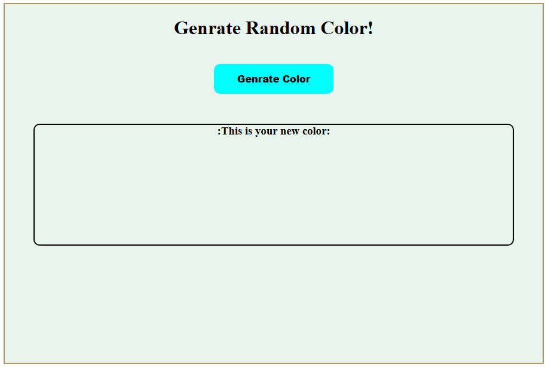
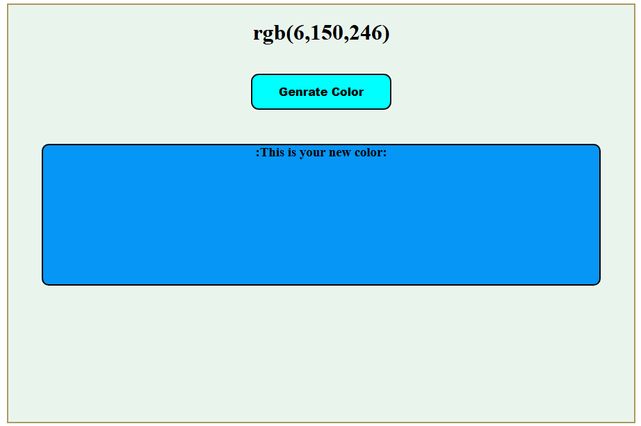
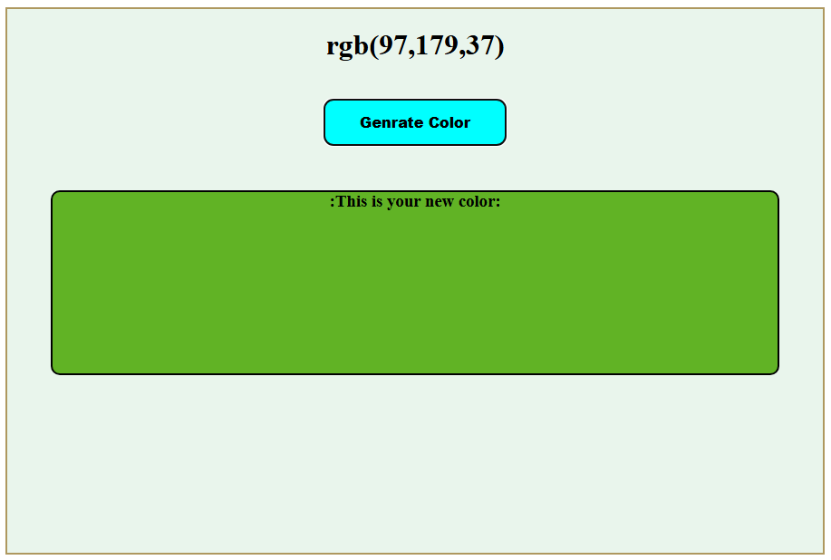

# 🎨 Random Color Generator

A simple web application that generates a random color every time you click a button. Built using **HTML**, **CSS**, and **JavaScript**.

## 🚀 Demo






## 🛠️ Features

- Generates a new random hex color code on every click
- Displays the color code
- Changes the background to the generated color
- Copy the color code by clicking a button (optional)

## 📁 Project Structure

```
random-color-generator/
├── index.html       # HTML structure
├── style.css        # Styling
├── script.js        # JavaScript logic
└── README.md        # Project documentation
```

## 📷 Preview


## 📌 Technologies Used

- HTML5
- CSS3
- JavaScript (ES6)

## 🔧 How to Use

1. Clone the repository:
   ```bash
   git clone https://github.com/your-username/random-color-generator.git
   cd random-color-generator
   ```

2. Open `index.html` in your browser.

3. Click the button to generate a new random color.

## 🧠 Logic Used

- `Math.random()` generates a random decimal
- Multiplied by `16777215` (maximum hex color value)
- Converted to hexadecimal using `.toString(16)`

## 📦 Example Code Snippet

```javascript
function generateColor() {
  const randomColor = "#" + Math.floor(Math.random() * 16777215).toString(16);
  document.body.style.backgroundColor = randomColor;
  document.getElementById("colorCode").textContent = randomColor;
}
```

## 🙌 Author

Made with ❤️ by [Your Name](https://github.com/your-username)

## 📃 License

This project is licensed under the MIT License.